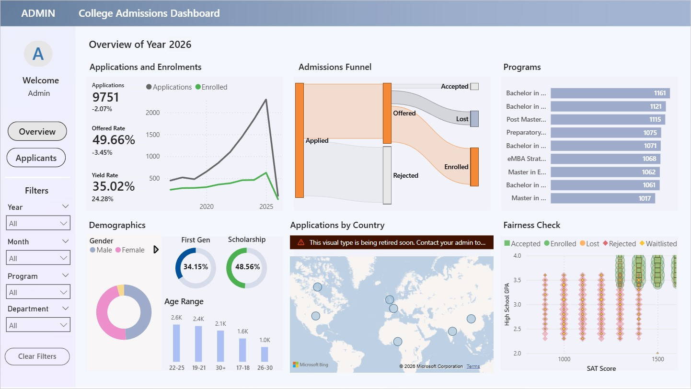
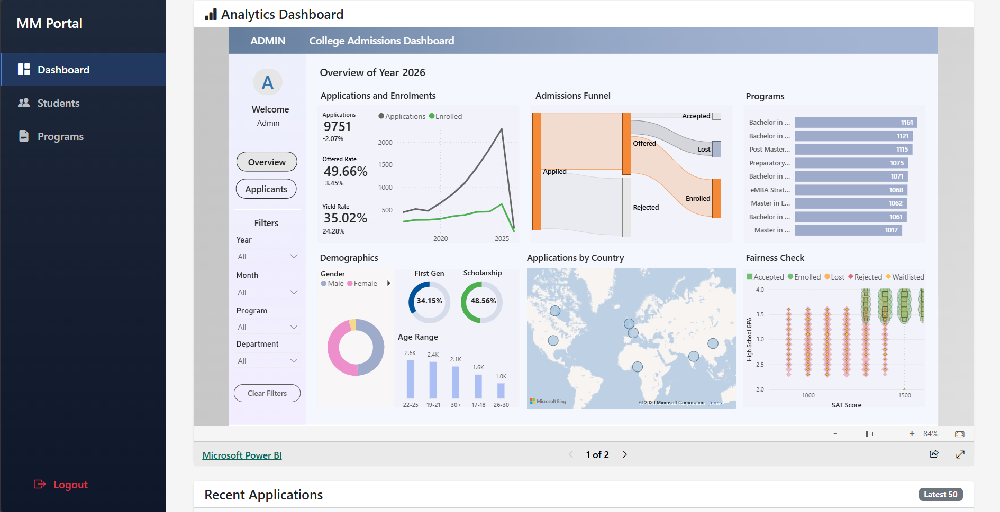
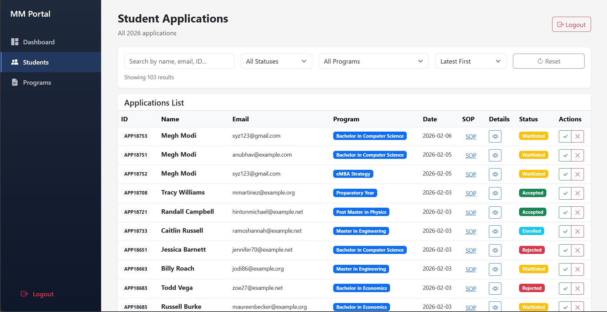

# 🎓 University Admissions Management System

A full-stack web application that simulates the complete lifecycle of a university admission process. It features **live data generation**, a transactional **SQL backend**, and **real-time analytics** via embedded Power BI.

*(Fig 1: The Admin Dashboard showing real-time applicant metrics)*

---

## 🎯 What Makes This Different

Unlike typical data analysis projects that rely on static, pre-existing datasets, this system creates its own data ecosystem:

* ✅ **Dynamic Data Generation:** Students submit *real* applications through the web interface, generating fresh data points instantly.
* ✅ **End-to-End Workflow:** Simulates the entire journey—from a student's submission to the database transaction, to the admin's decision-making process.
* ✅ **Live Analytics:** The embedded Power BI dashboard updates to reflect the latest SQL database state, enabling real-time decision-making.

---

## 🚀 Features & Interface

### 1. The Admin Portal
The command center for university staff. Admins can visualize trends and process applications efficiently.

* **Embedded Analytics:** A fully interactive Power BI report integrated directly into the Flask application.
* **Application Management:** View, filter, and sort incoming student applications.
* **One-Click Actions:** Accept or Reject applicants, triggering immediate status updates in the SQL database.
* **Program Management:** Monitor active programs and departmental statistics.

### 2. The Student Portal
A user-friendly interface for applicants to manage their admission journey.

* **Secure Authentication:** User registration and login functionality.
* **Application Submission:** Comprehensive forms capturing GPA, SAT scores, and Statements of Purpose (SOP).
* **Real-Time Tracking:** Students can see their application status change (Waitlisted → Accepted/Rejected) instantly after an admin decision.
* **Profile Management:** Record academic achievements, scholarships, and personal details.

---

## 🏗️ Architecture & Tech Stack

The application uses a robust MVC (Model-View-Controller) architecture with two operational modes (SQL Server or CSV-based).

| Component | Technology | Description |
| :--- | :--- | :--- |
| **Backend** | Python, Flask | Handles routing, auth logic, and data processing. |
| **Database** | MS SQL Server | Relational storage with normalized schema & constraints. |
| **Frontend** | HTML5, Bootstrap 5 | Responsive UI for mobile and desktop. |
| **Analytics** | Microsoft Power BI | Embedded reports for data visualization. |
| **Driver** | PyODBC | Secure SQL connectivity with parameterized queries. |

### Database Schema
The system relies on **7 normalized tables** to ensure data integrity:
`users` ↔ `applicants` ↔ `applications` ↔ `programs`
*(Plus supporting tables for achievements, academic profiles, and lookups)*

---

## ⚗️ The ETL Pipeline Architecture

Beyond being a web application, this project functions as a complete **ETL (Extract, Transform, Load)** pipeline that moves raw data into actionable insights.

### 1. Extract (Data Generation & Ingestion)
The system sources data from two origins:
* **User Input:** Raw form data captured from the Flask frontend.
* **Synthetic Simulation:** A custom Python script (`generate_data.py`) that acts as a data generator. It "extracts" probabilistic logic based on real-world Indian college trends (2017–2026) to create realistic applicant profiles.

### 2. Transform (Processing & Normalization)
Before storage, raw data undergoes significant transformation:
* **Normalization:** Flat CSV data is restructured into a 3NF (Third Normal Form) relational schema with 7 interconnected tables.
* **Data Cleaning:** The migration scripts handle date formatting, ID generation (e.g., `APP9001`), and null value handling.
* **Business Logic:** Application statuses are calculated based on acceptance rates and seasonal spikes (e.g., March-April peaks).

### 3. Load (Storage & Analytics)
* **Operational Storage:** Processed data is loaded into **Microsoft SQL Server** using transaction-safe operations to ensure integrity.
* **Analytical Loading:** The data is finally ingested by **Power BI**, which visualizes the "Load" stage through a live dashboard embedded back into the Admin Portal.

---

## 🛠️ Installation & Usage

I have designed this application to run in two modes:
1.  **SQL Server Mode (Recommended):** Full production simulation.
2.  **CSV Mode:** Lightweight version for testing without a database server.

👉 **[Click here for the Detailed USAGE Guide](USAGE.md)**
*Complete instructions on generating synthetic data, migrating to SQL, and configuring the Power BI dashboard.*

---

## 🔮 Future Roadmap

* [ ] **Cloud Deployment:** Deploy database to Azure SQL and app to Azure App Service.
* [ ] **Containerization:** Dockerize the application for consistent deployment environments.
* [ ] **Automation:** Implement email notifications for status updates.
* [ ] **CI/CD:** Set up GitHub Actions for automated testing and deployment.

## 🎓 Key Learning Outcomes

* **Full-Stack Development:** Integrating a Python/Flask backend with a responsive frontend.
* **Database Design:** Implementing normalization, foreign keys, and transaction integrity.
* **Data Engineering:** Building pipelines that move data from User Input → SQL Server → BI Tools.
* **Security:** Handling role-based access control (RBAC) and preventing SQL injection.

---

## 📄 License

Educational project - MIT License
